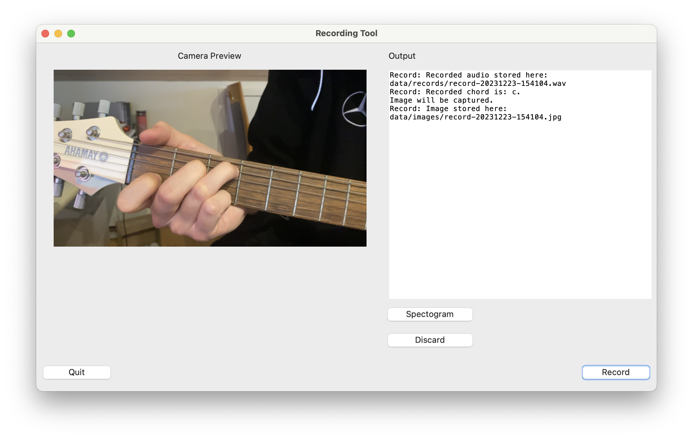

# Guitar Chord Classifier

This project is still under active development.

The main objective of this project is to create an own dataset with images from guitar chords.
To achieve this, an existing guitar chord detection is integrated.
If a chord was detected successfully, an image will be created, labelled and stored.

For chord detection, some parts of this project are integrated: 
https://github.com/ayushkumarshah/Guitar-Chords-recognition
This project is licenced under [GNU GPL3](https://www.gnu.org/licenses/gpl-3.0.en.html).

After the collection of a meaningful sum of images is done (separated in training and validation datasets), 
an own Convolutional Neural Network (CNN) will be trained, based on the created dataset.

In the current version of this project the following chords can be predicted by CNN:
- A
- Am
- Bm
- C
- D
- Dm
- E
- Em
- F
- G

## Getting started
Clone repository with `git clone https://gitlab.reutlingen-university.de/keckm/guitar_chord_detector.git`.

### Preconditions
1. [Optional] Connect an audio interface (e.g. Steinberg UR22C)
2. [Optional] Get idVendor and idProduct from audio interface by entering `lsusb` in macOS/ubuntu terminal and 
change values in `Settings.py`
3. Enter camera index in `Settings.py`: macOS (camera_index=1), ubuntu (camera_index=-1)
4. 

If you are not connecting a physical audio interface, there is a fallback implemented to
test this project. In this case, one of the example audio files from `data/records/` will be used.
You can select one of those paths by commenting in or out in line 48-55 in `src/user_interface/GUIAppController.py`.

### Install libraries
To get all needed libraries, open a new terminal and execute `pip install -r requirements.txt` in cloned 
folder `Guitar_Chord_Detector`. 
It is recommended to do this in a virtual environment which can be created with 
e.g. venv (https://docs.python.org/3/library/venv.html).

### Part 1: Create dataset(s) with chord images
Start with `python main.py` in root directory of this project. A Graphical User Interface (GUI) will 
be opened.

The GUI will look like this:

In this screenshot you can see the camera preview to predict the image that will be captured 
if a chord could be detected. On right side you can see some statements like 'Recorded chord is: c'.

### Part 2: Create CNN based on captured images
tbd

## Troubleshooting
### Tkinter not found
Sometimes the error message "tkinter not found" appears at the first start. To get it worked, install tkinter
for your Python version. If you are using Python v3.10 or v3.11 then the following commands can
help you to get it worked:

###### MacOS (tested)
Install for Python 3.x versions: `pip3 install tk`
Install for specific version globally: `brew install python-tk@3.10`. This requires [Homebrew](https://brew.sh). 
Replace @3.10 with your version. 
You can get your version by entering `python --version` in terminal.

###### Ubuntu (tested)
Install tkinter for Python v3.x with this command: `sudo apt-get install python3-tk`

###### Windows (not tested)
Try `pip install tk` for local installation or `python -m pip install tk` to install globally.
Second option is installation with a virtual env framework like [anaconda](https://docs.anaconda.com/free/anaconda/install/windows/).

## Further development
### Extend amount of chords
In the current version of this project there are only 10 chords that can be predicted by CNN.

The project from ayushkumarshah, which is used in this project 
(https://github.com/ayushkumarshah/Guitar-Chords-recognition) offers an explanation how to extend 
and re-train the model.

### Audio preprocessing
To increase the accuracy of prediction, a preprocessing algorithm for recorded audio can be helpful.
This is not implemented in the current version of this project. To achieve a mostly clean audio file, the
gain option of the audio interface is adjusted to avoid noised and get a sufficient recognition of the 
played chord.

### Improve CNN model
It is unknown, if the used, trained model for chord-audio-recognition is "good" but it was sufficient for this 
project. In further developments a new model could be trained, based on given datasets from 
[Kaggle](https://www.kaggle.com). There are several datasets like...
- https://www.kaggle.com/code/mpwolke/guitar-chords-wav/notebook
- https://www.kaggle.com/datasets/fabianavinci/guitar-chords-v3

... and more.

## Authors and acknowledgment
Manuel Keck\
Human-Centered Computing (INF)\
Reutlingen University\
2023

This project is a product of HUC2.5 Bildverarbeitung from Human-Centered Computing (INF) at Reutlingen 
University.

## License
This project is an open-source project.

The following libraries are/were used and are categorized by licence.
The following information is not guaranteed to be complete and correct.

[MIT License](https://opensource.org/licenses/MIT):
pyaudio,
sounddevice,
pip,
wheel,
rsa,
setuptools,
gdown,
lazycats,
requests,
wrapt,
rich,
pyasn1,
termcolor,
pycparser,
pyparsing,
oauthlib,
MarkupSafe,
idna,
pyusb,
screeninfo,
cffi,
filelock,
platformdirs,
wrapt,
gdown,
lazycats,
pydub,
noisereduce,
pedalboard,
fonttools

[BSD License](https://opensource.org/licenses/BSD-3-Clause):
numpy,
scipy,
Pillow,
six,
numba,
packaging,
scikit-learn,
python-dateutil,
Markdown,
llvmlite,
h5py,
soundfile,
cachetools,
contourpy,
cycler,
kiwisolver,
opencv-python,
pooch,
joblib,
werkzeug,
contourpy,
decorator,
torchvision

[Apache License 2.0](https://opensource.org/licenses/Apache-2.0):
tensorflow,
tensorboard,
astunparse,
flatbuffers,
urllib3,
soupsieve,
cython,
msgpack,
requests

[LGPL (Lesser General Public License)](https://www.gnu.org/licenses/lgpl-3.0.html):
usb,
soxr

[ISC License](https://opensource.org/licenses/ISC):
librosa

[Matplotlib License](https://matplotlib.org/stable/users/license.html):
matplotlib,
cycler
