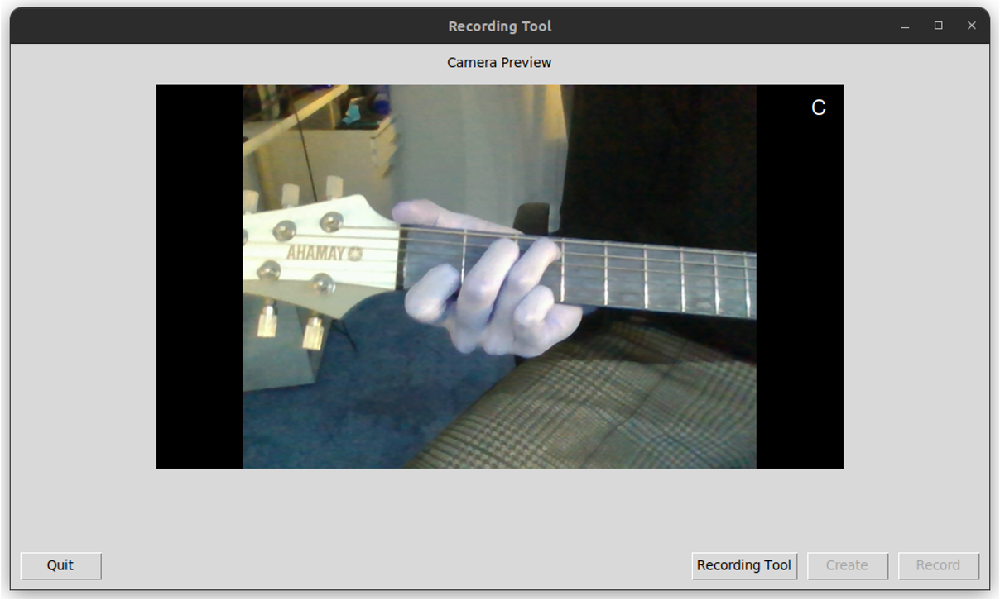
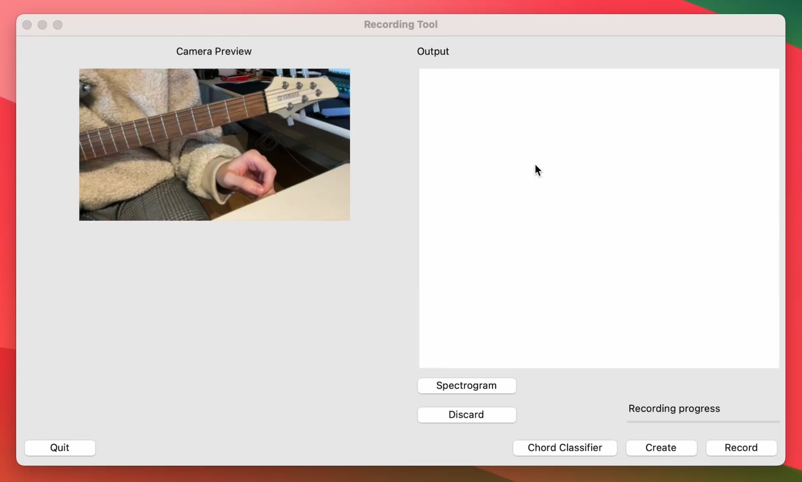
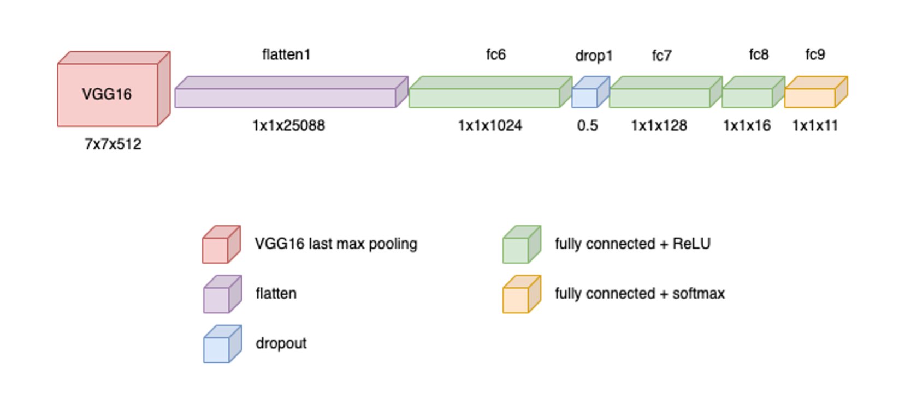

# Guitar Chord Classifier

Feb. 2024: This project is still under active development.

The main objective of this project is to create an own dataset with images from guitar chords.

To achieve this, an existing guitar chord detection is integrated.
If a chord was detected successfully, an image will be created, labelled and stored. To save the image, 
the hand (which is performing the chord) will be determined with 
[Google MediaPipe](https://mediapipe.readthedocs.io/en/latest/index.html) 
([Hands](https://developers.google.com/mediapipe/solutions/vision/hand_landmarker)). 

For chord detection, some parts of this project are integrated: 
https://github.com/ayushkumarshah/Guitar-Chords-recognition
This project is licenced under [GNU GPL3](https://www.gnu.org/licenses/gpl-3.0.en.html).

This project is splitted into two parts. In the first part, the dataset will be created. Therefore, a GUI
is implemented, which contains a 'record' button. By clicking on 'record', an audio stream will be recorded
(if an audio interface is connected, see section 'Preconditions' below) and the chord will be predicted by 
a CNN. After a chord could be predicted, an image will be captured, cropped and saved.

In the second part, the dataset will be used to train an own model. The GUI looks slightly different. There
is an camera preview, which collects the frames and tries to predict the played chord based on visual imput.

You can get further information in sections 'Part 1' and 'Part 2' below.

In the current version of this project the following chords can be predicted by CNN:
- A
- Am
- Bm
- C
- D
- Dm
- E
- Em
- F
- G

## Getting started
Clone repository with `git clone https://github.com/manuelkeck/Guitar_Chord_Classifier.git`.

### Preconditions
1. [Optional] Connect an audio interface (e.g. Steinberg UR22C)
2. [Optional] Get idVendor and idProduct from audio interface by entering `lsusb` in macOS/ubuntu terminal and 
change values in `Settings.py`
3. Enter camera index in `Settings.py`. MacOS uses camera_index = 1 for inbuild FaceTime HD cam or camera_index = 0 
to use iPhone as camera. You can get further information from [Apple docs](https://support.apple.com/de-de/guide/mac-help/mchl77879b8a/mac). Ubuntu used camera_index = -1 in my test environment.

If you are not connecting a physical audio interface, there is a fallback implemented to
test this project. In this case, one of the example audio files from `data/records/` will be used.
You can select one of those paths by commenting in or out in line 48-55 in `src/user_interface/GUIAppController.py`.

### Install libraries
To get all needed libraries, open a new terminal and execute `pip install -r requirements.txt` in cloned 
folder `Guitar_Chord_Classifier`. 

It is recommended to do this in a virtual environment which can be created with 
e.g. venv (https://docs.python.org/3/library/venv.html). In this project [Python v3.10.13](https://www.python.org/downloads/release/python-31013/) is used.
To create a virtual environment with venv, go to terminal in cloned project folder and type `python3.10 -m venv myenv`
to create the virtual enviroment and `source myenv/bin/activate` to activate the created environment. Now install 
the requirements within the environment.

### Part 1: Create dataset(s) with chord images
This part of the project is in branch `train_vgg16`. Switch to this branch with command `git checkout train_vgg16`
in root directory of this project. Start with `python Recorder.py` in branch directory. A Graphical User Interface (GUI) will 
be opened.

The GUI to create the dataset will look like this (click to watch video):

After the chord was predicted successfully, an image will be captured and hand landmarks will be drawn
on it. Based on the landmarks the image will be presented to check if it is correct.
If the image is not sufficient, click on 'discard' to discard the record and captured image.
The images will be used to train an own model in 'Part 2'.

On right side you can see some statements like 'Recorded chord is: G'.

Because it's hard to create a complete dataset with this workflow, a 'fast-lane' implementation is
integrated. By clicking on 'create', you will be able to capture a defined amount of images within seconds.
The button will open a popup. Just entering a valid chord and click on 'confirm'. After clicking on
'confirm', several images will be captured and stored. You can set the amount of images captured in
on period in `Settings.py` in variable `AMOUNT`.

Please be aware, that there is no hand detection in this 'fast-lane' implementation. The captured image
will be transformed into a 640x360 px image and saved immediately. You can set the resolution in `Settings.py`.

### Part 2: Create CNN based on captured images
Based on the dataset (which is uploaded in path data/images/) a CNN was trained. Therefore, VGG16 was used and 
classification stage replaced with the following architecture:

This part can be discovered in branch `train_vgg16` too, since main branch is still under active development to 
integrate landmark detection for CNN training.

At the moment, the best model needs up to one minute for training (with NVIDIA RTX3070 Max-Q) and unfortunately it 
reaches a precision of only 9,4 %.
In current version, augmentation of data is not implemented. This will be added in later developments with
hand landmark detection data to train an advanced model (written in Feb. 2024).

Due to file size the model is not uploaded.
To train the model by yourself, just start `python TrainVGG16.py` in root directory of the project.
After that, you can add the model to the GUI in `GUIApp.py`. You can find it in `src/user_interface/GUIApp.py` where
you can add your trained model in line 33.

Then, start GUI application with `python Recorder.py` and click on the button `Chord Classifier` to test your model
with real conditions.

## Troubleshooting
### Tkinter not found
Sometimes the error message "tkinter not found" appears at the first start. To get it worked, install tkinter
for your Python version. If you are using Python v3.10 or v3.11 then the following commands can
help you to get it worked:

###### MacOS (tested)
Install for Python 3.x versions: `pip3 install tk`
Install for specific version globally: `brew install python-tk@3.10`. This requires [Homebrew](https://brew.sh). 
Replace @3.10 with your version. 
You can get your version by entering `python --version` in terminal.

###### Ubuntu (tested)
Install tkinter for Python v3.x with this command: `sudo apt-get install python3-tk`

###### Windows (not tested)
Try `pip install tk` for local installation or `python -m pip install tk` to install globally.
Second option is installation with a virtual env framework like [anaconda](https://docs.anaconda.com/free/anaconda/install/windows/).

## Further development
### Extend amount of chords
In the current version of this project there are only 10 chords that can be predicted by CNN.

The project from ayushkumarshah, which is used in this project 
(https://github.com/ayushkumarshah/Guitar-Chords-recognition) offers an explanation how to extend 
and re-train the model.

### Audio preprocessing
To increase the accuracy of prediction, a preprocessing algorithm for recorded audio can be helpful.
This is not implemented in the current version of this project. To achieve a mostly clean audio file, the
gain option of the audio interface is adjusted to avoid noises and get a sufficient recognition of the 
played chord.

### Improve CNN model for auditive prediction
It is unknown, if the used, trained model for chord-audio-recognition is "good" but it was sufficient for this 
project. In further developments a new model could be trained, based on given datasets from 
[Kaggle](https://www.kaggle.com). There are several datasets like...
- https://www.kaggle.com/code/mpwolke/guitar-chords-wav/notebook
- https://www.kaggle.com/datasets/fabianavinci/guitar-chords-v3

... and more.

### Performance optimization
Currently, the performance is not sufficient, to create a holistic dataset with implemented workflow
of 'Part 1'. There are sometimes memory issues or camera queuing issues, which can crash the program.
This needs to be investigated in further developments.

## Authors and acknowledgment
Manuel Keck\
Human-Centered Computing (HUC)\
Informatics (INF) Faculty\
Reutlingen University\
2024

Contact: manuel.keck@student.reutlingen-university.de

This project is a product of 'HUC2.4-Bildverarbeitung' from Human-Centered Computing at Reutlingen 
University.

## License
This project is an open-source project.

The following libraries are/were used and are categorized by licence.
The following information is not guaranteed to be complete and correct.

[MIT License](https://opensource.org/licenses/MIT):
pyaudio,
sounddevice,
pip,
wheel,
rsa,
setuptools,
gdown,
lazycats,
requests,
wrapt,
rich,
pyasn1,
termcolor,
pycparser,
pyparsing,
oauthlib,
MarkupSafe,
idna,
pyusb,
screeninfo,
cffi,
filelock,
platformdirs,
wrapt,
gdown,
lazycats,
pydub,
noisereduce,
pedalboard,
fonttools

[BSD License](https://opensource.org/licenses/BSD-3-Clause):
numpy,
scipy,
Pillow,
six,
numba,
packaging,
scikit-learn,
python-dateutil,
Markdown,
llvmlite,
h5py,
soundfile,
cachetools,
contourpy,
cycler,
kiwisolver,
opencv-python,
pooch,
joblib,
werkzeug,
contourpy,
decorator,
torchvision

[Apache License 2.0](https://opensource.org/licenses/Apache-2.0):
tensorflow,
tensorboard,
astunparse,
flatbuffers,
urllib3,
soupsieve,
cython,
msgpack,
requests

[LGPL (Lesser General Public License)](https://www.gnu.org/licenses/lgpl-3.0.html):
usb,
soxr

[ISC License](https://opensource.org/licenses/ISC):
librosa

[Matplotlib License](https://matplotlib.org/stable/users/license.html):
matplotlib,
cycler
